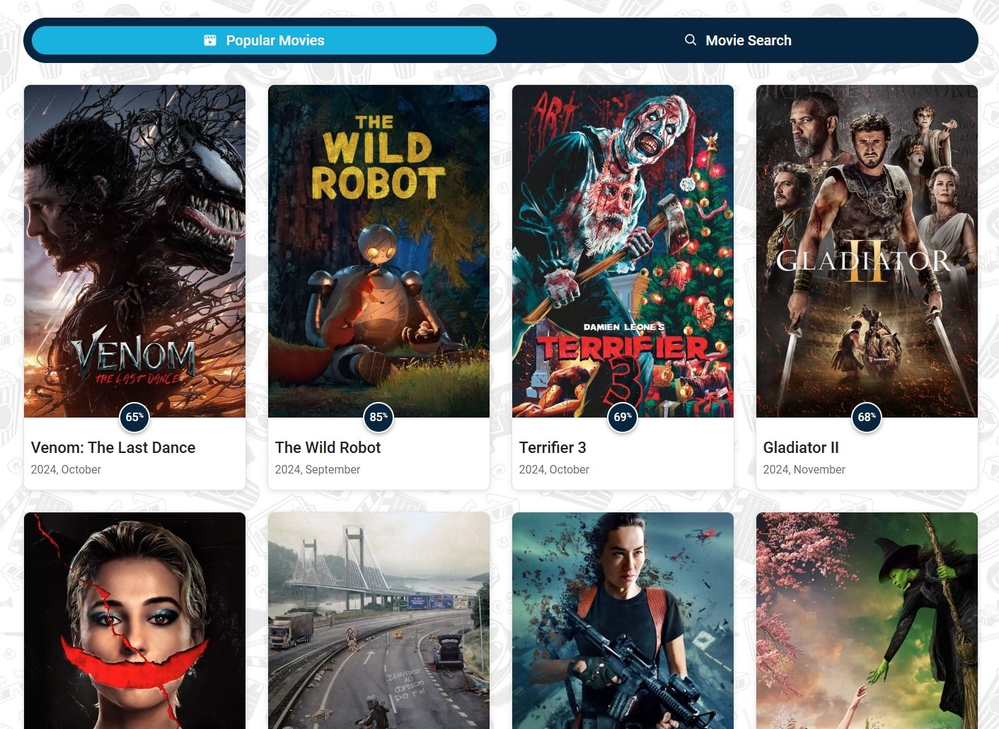

# Movies App

A responsive movie search application developed using the Mobile-First approach. This project is built with React and utilizes React Router for navigation. It allows users to search for movies, view detailed information, and explore trending films using the TMDB API.

## Live Demo
🔗 [Movies App](https://goit-react-hw-05-nine-plum.vercel.app/)

## Features
- 🔍 **Movie Search**: Search for movies using the TMDB API.
- 🎬 **Trending Movies**: Browse the latest trending movies.
- 📃 **Movie Details**: View details such as title, overview, release date, and user ratings.
- 🎭 **Cast & Reviews**: Access information about the movie's cast and read user reviews.
- 📱 **Responsive Design**: Optimized for mobile-first experience.

## Tech Stack
- **React** (Vite-based setup)
- **React Router** for navigation
- **TMDB API** for movie data
- **Axios** for API requests
- **CSS Modules & CLSX** for styling
- **React Icons, React Toast, React Spinners** for UI enhancements
- **Formik** for form handling
- **React-Loader-Spinner** for loading indicators

## Installation & Setup
To run this project locally, follow these steps:

1. **Clone the repository**
   ```sh
   git clone https://github.com/Valentyn-M/Movies-App_goit-react-hw-05.git
   cd Movies-App_goit-react-hw-05
   ```

2. **Install dependencies**
   ```sh
   npm install
   ```

3. **Run the development server**
   ```sh
   npm run dev
   ```

4. **Open in browser**
   Navigate to `http://localhost:5173/` (or as indicated in the terminal output).

## Project Structure
```
Movies-App_goit-react-hw-05/
│── public/                # Static assets
│── src/                   # Source code
│   ├── components/        # Reusable components
│   ├── pages/             # Application pages
│   ├── services/          # API services
│   ├── styles/            # Global styles
│── .gitignore
│── package.json
│── vite.config.js
│── README.md
```

## Deployment
The app is deployed on **Vercel**:
🔗 [Live Demo](https://goit-react-hw-05-nine-plum.vercel.app/)

To deploy your own version:
```sh
npm run build
vercel deploy
```

## License
This project is licensed under the MIT License.
